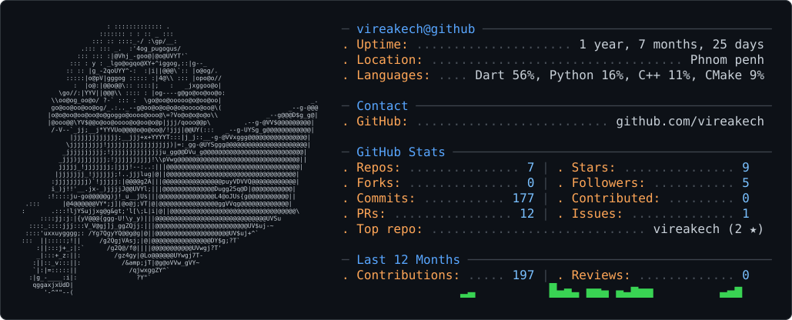

 

<picture>
  <source media="(prefers-color-scheme: dark)" srcset="dark_mode.svg" />
  <source media="(prefers-color-scheme: light)" srcset="light_mode.svg" />
  
</picture>
 

 

  <picture>
    <source
      media="(prefers-color-scheme: dark)"
      srcset="https://raw.githubusercontent.com/vireakech/vireakech/pacman-output/pacman-contribution-graph-dark.svg"
    />
    <source
      media="(prefers-color-scheme: light)"
      srcset="https://raw.githubusercontent.com/vireakech/vireakech/pacman-output/pacman-contribution-graph.svg"
    />
    
  </picture>

  

  

  

<!-- THANK YOU SECTION WITH TYPING EFFECT -->

